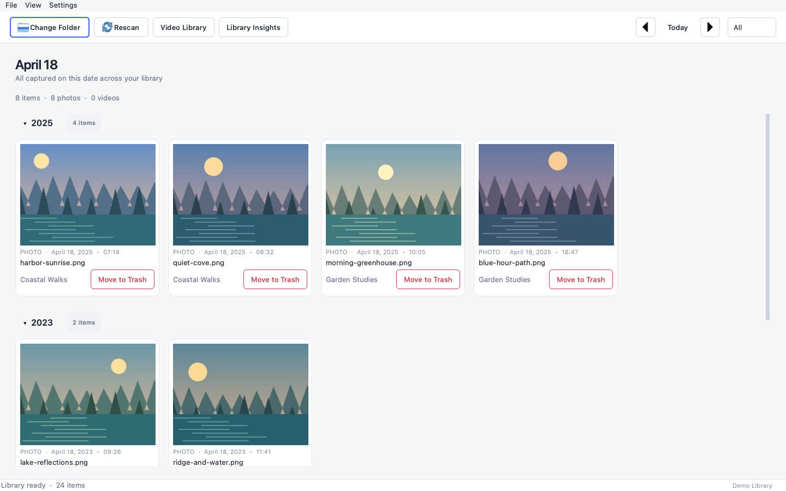
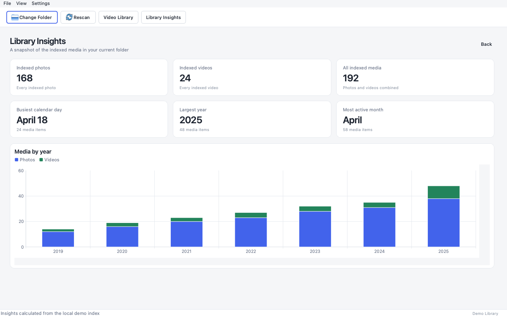
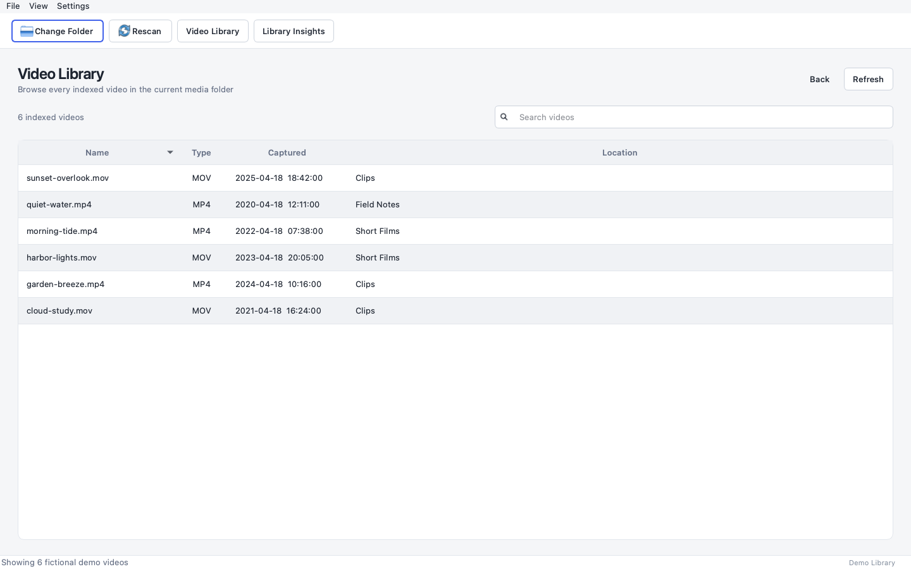

# On This Day

A privacy-first desktop app for rediscovering photos and videos captured on the
same calendar day across different years.

On This Day turns a local media folder into a focused daily timeline. It reads
capture dates from media metadata, builds a reusable SQLite index, and presents
matching moments in a polished PySide6 interface. Media inspection, thumbnail
generation, search, and library analytics all stay on your computer.

## Highlights

- Recursively indexes a local folder without uploading its contents.
- Groups matching photos and videos by capture year for the selected month and day.
- Browses the previous day, next day, or today's date from the main toolbar.
- Filters the gallery to all media, photos only, or videos only.
- Generates thumbnails away from the main interface and reuses cached results.
- Loads large year groups in batches to keep the gallery responsive.
- Includes a searchable, sortable library of every indexed video.
- Calculates folder-specific Library Insights from the existing SQLite index.
- Opens media in the operating system's default application.
- Supports system, light, and dark appearance modes.
- Moves an item to the operating system's Trash only after explicit confirmation.
- Preserves the existing app settings, media index, and compatible thumbnail cache.

## Screenshots

The screenshots below were captured from a disposable demo library containing
synthetic artwork, fictional filenames, and fictional dates. They contain no
personal media, real library paths, or embedded metadata.

### Date-based gallery

Browse matching moments by year, switch between photos and videos, and manage an
item directly from its gallery card.



### Library Insights

Review folder-specific totals, highlights, and the photo-and-video mix over time.



### Video Library

Search and sort indexed videos without leaving the desktop app.



## How it works

1. Choose the folder containing your photo and video library.
2. The app recursively scans supported media and stores file details and detected
   capture dates in a local SQLite index.
3. The gallery queries that index for media captured on the selected month and day,
   then groups the results from newest to oldest year.
4. Later scans reuse unchanged records, update changed files, and remove index
   entries for files that are no longer present.

The initial scan can take time for a large library. Subsequent scans are faster
because unchanged files do not need to be analyzed again.

## Requirements

- Python 3.10 or newer
- macOS for the primary supported desktop experience
- Read access to the selected media folder
- Permission to modify the selected folder only if using **Move to Trash**

Python dependencies are installed from `requirements.txt`:

- [PySide6](https://doc.qt.io/qtforpython-6/) for the desktop interface and charts
- [Pillow](https://pillow.readthedocs.io/) for image metadata and thumbnails
- [pillow-heif](https://github.com/bigcat88/pillow_heif) for HEIC and HEIF support
- [imageio-ffmpeg](https://github.com/imageio/imageio-ffmpeg) for video metadata
  and thumbnails

The app still starts if HEIC/HEIF or FFmpeg support is unavailable, but the related
media formats or video features will be limited.

## Installation

### 1. Clone the repository

```bash
git clone https://github.com/bardakanian/on-this-day-photo-viewer.git
cd on-this-day-photo-viewer
```

### 2. Create and activate a virtual environment

```bash
python3 -m venv .venv
source .venv/bin/activate
```

### 3. Install dependencies

```bash
python -m pip install --upgrade pip
python -m pip install -r requirements.txt
```

### 4. Launch the app

```bash
python app.py
```

On first launch, choose a folder containing photos and videos. The selected folder,
appearance preference, SQLite index, thumbnail cache, and application log are kept
in the local app-data directory described below.

## Using the app

### Browse the daily gallery

- Use **Choose Folder** to select or change the active media library.
- Use **Rescan** after adding, moving, editing, or removing files outside the app.
- Use the arrow controls to browse adjacent dates or **Today** to return to the
  current date.
- Use the media filter to show all items, photos only, or videos only.
- Select a thumbnail to open the original in its default application.
- Collapse or expand a year section to focus the timeline.

### Search the Video Library

Open **Video Library** to browse every indexed video in the selected folder. The
table can be searched, sorted by its visible columns, and opened from the selected
row. Search matches the filename, media type, capture timestamp, and containing
folder shown in the table.

### Explore Library Insights

Open **Library Insights** from the main toolbar or the **View** menu. The dashboard
uses the current folder's existing SQLite index, so it does not rescan the
filesystem. It includes:

- Total indexed photos, videos, and combined media
- The busiest calendar day across all capture years, including February 29
- The capture year containing the most indexed media
- The most active calendar month across all capture years
- A chronological stacked bar chart of photos and videos by capture year
- Exact photo, video, and total values in chart hover details

Records without the date components required by a statistic are omitted only from
that calculation and still count toward library totals. When counts tie, the
earliest calendar day, year, or month is selected consistently.

### Move media to Trash

Each gallery card includes **Move to Trash**. The app shows the exact filename and
requires confirmation before asking the operating system to move the original
file to Trash. After a successful move, the matching SQLite record and cached
thumbnail are removed and the gallery and Library Insights are refreshed.

This action affects the original media file. Confirm that your system Trash and
backups meet your recovery needs before using it.

## Capture-date detection

For images, the app prefers embedded EXIF timestamps and then checks macOS metadata
when available. For videos, it checks embedded metadata through FFmpeg, followed by
macOS metadata and filesystem timestamps. A file's modification time is used as a
final fallback when no stronger image date is available.

Because metadata can be missing or incorrect, review detected dates before relying
on the index for organizational decisions.

## Supported media

| Category | Formats |
| --- | --- |
| Images | JPG, JPEG, PNG, TIFF, BMP, GIF, WebP, HEIC, HEIF |
| Videos | MOV, MP4, M4V, AVI, MKV, WMV, MPEG, MPG, 3GP |

Animated images use their first readable frame for the cached thumbnail. Video
thumbnail and embedded-date support depend on the bundled FFmpeg capability.

## Privacy and local data

On This Day performs media processing locally. The application contains no account
sign-in, advertising, telemetry, analytics reporting, cloud synchronization, or
media-upload feature.

Application data is stored under:

```text
~/.on_this_day_photo_viewer/
├── config.json
├── on_this_day.log
├── photo_index.sqlite3
└── thumbnails/
```

The configuration and SQLite index can contain the absolute path of the selected
library and individual media files. The log can contain operational error details.
Do not publish or commit this app-data directory.

The app normally reads source media to identify dates, create thumbnails, and open
files on request. The only intentional source-file modification is the explicitly
confirmed **Move to Trash** action.

## Keyboard shortcuts

On macOS, Qt presents the Control-based shortcuts below using the Command key where
appropriate.

| Action | Shortcut |
| --- | --- |
| Choose media folder | `⌘O` |
| Rescan library | `⌘R` |
| Previous day | `⌘←` |
| Next day | `⌘→` |
| Go to today | `⌘T` |
| Open Video Library | `⌘⇧V` |
| Open Library Insights | `⌘⇧I` |
| Search videos | `⌘F` |
| Open settings | `⌘,` |
| Close window | `⌘W` |

## Project structure

```text
app.py                    Application entry point
onthisday/
├── core/
│   ├── database.py       SQLite repository and Library Insights queries
│   ├── indexer.py        Recursive, incremental media indexing
│   ├── media.py          Metadata detection and thumbnail generation
│   ├── models.py         Shared immutable data models
│   └── settings.py       Local configuration persistence
└── ui/
    ├── pages/            Gallery, Video Library, and Library Insights
    ├── theme/            Color palettes, typography, metrics, and stylesheets
    └── widgets/          Media cards, responsive flow layout, and shared controls
tests/                    Storage, indexing, deletion, and analytics tests
assets/screenshots/       Sanitized documentation screenshots
```

## Development

Run the automated tests from the project root:

```bash
python -m unittest discover -s tests -v
```

Check that the application modules compile:

```bash
python -m compileall -q onthisday app.py
```

For this checkout, the project virtual environment can be used directly:

```bash
.venv/bin/python -m unittest tests.test_core -v
```

## Troubleshooting

- **HEIC or HEIF files are missing:** confirm that `pillow-heif` installed in the
  same environment used to launch the app.
- **Video dates or thumbnails are unavailable:** confirm that `imageio-ffmpeg` is
  installed, then rescan the library.
- **Recently changed media is not visible:** use **Rescan** to refresh the index.
- **A detected date looks wrong:** inspect the file's EXIF, embedded video metadata,
  Spotlight metadata, and filesystem timestamps.
- **The app cannot move a file to Trash:** confirm that the file still exists and
  the current user has permission to modify its containing folder.

## Project status

The app is under active development. Use a backed-up media library, review detected
capture dates, and keep the local app-data directory out of source control.

## Development approach

Developed with AI-assisted tools under human direction, review, testing, and refinement.

## License

This project is available under the MIT License.
